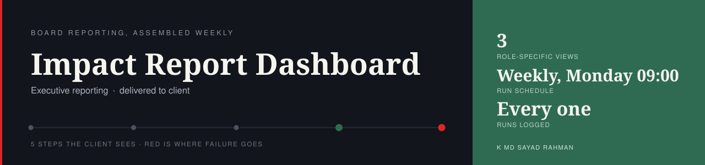
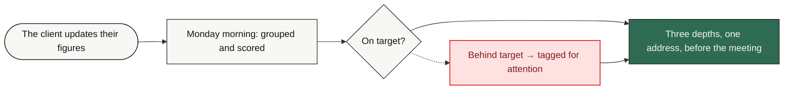

# Impact Report Dashboard

**The weekly board picture is assembled, tagged and published before Monday's meeting, instead of costing someone the better part of a day to put together by hand.**

    

> [!NOTE]
> **Where this system comes from.** Businesses in this sector post this problem publicly, in their own words — job briefs on Upwork and Fiverr. I took the brief as the specification, designed a system for the problem exactly as stated, and built it to production standard on my own infrastructure. Nothing in it was added to look impressive: every part of it answers something in the brief.
>
> It was built as a product rather than a one-off — built once, ready to deploy for any business with this problem. **It has not been sold or deployed into a customer's business: it is available, not delivered.** What follows is the real system — how it works, how it fails, and what it does not do.

| | |
| :--- | :--- |
| **Built for** | Boards and executive teams |
| **The brief** | Real briefs, posted publicly — businesses in this sector describing this exact problem in their own words, on Upwork and Fiverr |
| **Industry** | Executive reporting |
| **Status** | running · public demo |
| **My role** | Sole engineer — I read the brief, scoped it, designed the system, built it and ran it |
| **Availability** | Ready to deploy — built to production standard and running on my own infrastructure. Not sold, and not running inside a customer's business. |

---

### On this page

[The problem](#the-problem) · [What changed](#what-changed) · [How it works](#how-it-works) · [When it breaks](#when-it-breaks) · [The stack](#the-stack) · [Limitations](#honest-limitations) · [Read deeper](#read-deeper)

---

## The problem

A board secretary was spending the better part of a day every week assembling departmental figures into one report.

The day was not the only cost. Figures copied by hand go stale between assembly and the meeting. One report cannot serve a board member and a department manager at the same depth, so it ends up serving neither well. And once a file has been emailed around, there is no longer one version of it.

The failure that matters here is not a missing report. It is a meeting where three people are reading three different numbers and none of them knows it.

## What changed

| | Before | After |
| :--- | :--- | :--- |
| **Assembling the report** | The better part of a day, weekly | Runs on a schedule, unattended |
| **Data age at the meeting** | As old as the day it was typed | Read at generation time on Monday morning |
| **Depth of detail** | One report for every audience | Three depths from one dataset |
| **Versions in circulation** | However many were emailed | One address, always current |
| **Departments falling behind** | Spotted if someone reads carefully | Tagged before anyone opens it |

Before/after describes the change in process, not benchmarked throughput. Where a number is not measured, it is not claimed.

## How it works

Department figures land in a database from an interface the client already knows how to use. A weekly run groups them, scores each department against its own target, tags the ones falling behind, and renders three depths of the same dataset — board, chief executive, manager — to one stable address.

<table>
<tr>
<td width="42" valign="top" align="center"><b>01</b></td><td valign="top"><b>Nothing to remember</b> The run happens on a schedule. Nobody starts it, and nobody has to be back from leave for it to happen.</td>
</tr>
<tr>
<td width="42" valign="top" align="center"><b>02</b></td><td valign="top"><b>The figures come from where they already are</b> The client updates the same interface they were already using. No new tool to learn was part of the requirement, not an afterthought.</td>
</tr>
<tr>
<td width="42" valign="top" align="center"><b>03</b></td><td valign="top"><b>Monday morning it assembles itself</b> Figures are grouped by department and each is scored against its own target — the same way every week, which is the point.</td>
</tr>
<tr>
<td width="42" valign="top" align="center"><b>04</b></td><td valign="top"><b>Problems are marked, not buried</b> A department behind its target is tagged before anyone opens the report, rather than being something a reader has to notice.</td>
</tr>
<tr>
<td width="42" valign="top" align="center"><b>05</b></td><td valign="top"><b>Each audience gets its own depth</b> Board, chief executive and manager read three renderings of one dataset. Nobody is handed detail they did not ask for, and nobody is missing detail they need.</td>
</tr>
<tr>
<td width="42" valign="top" align="center"><b>06</b></td><td valign="top"><b>One address, not an attachment</b> The report is a link that is always current. That is what removes the question of which copy is the real one.</td>
</tr>
</table>

### How it flows

What happens to the client's work, in the order they experience it. The internal build — node graph, execution order, prompts, thresholds — is deliberately not published.

<b>What the shapes mean</b> — colour is not the only signal

| Shape | Means |
| :--- | :--- |
| **rounded** | Where the client's process starts |
| **box** | Something the system does |
| **diamond** | A decision point |
| **slanted** | A person has to act |
| **green box** | The good outcome |
| **red box** | Failure path — held, escalated or alerted |

Red appears in exactly one role across every repo in this portfolio: where failure goes. Nowhere else. If you see red, something is being held, escalated or alerted.

> **Walk it interactively** — [`docs/index.html`](docs/index.html) is a single self-contained page. Download it, open it in any browser, and press **Break it** to watch the failure path light up. Nothing to install, no network calls.

## When it breaks

Most automation portfolios show you the happy path. The happy path is the easy half. This is the half that decides whether a system survives contact with a real business.

| What goes wrong | How it is detected | What the system does | Who finds out |
| :--- | :--- | :--- | :--- |
| **The client has not updated their figures** | Source unchanged since the last run | Publishes with the previous week's data, labelled with its date | Dashboard states the date it was generated from |
| **A department is missing entirely** | Expected group absent from the dataset | Renders the report without it rather than dropping the run | Report shows the department as not reported |
| **The datastore is unreachable on a Monday** | Connection error at read time | Halts before publishing — the previous report stays up rather than being replaced by a broken one | Alert, immediately |
| **A figure arrives in the wrong format** | Type check while grouping | That figure is held out and marked, the rest of the report still renders | Marked in place, on the report itself |
| **A run produces nothing** | Empty output after grouping | Treated as a fault, not as an empty week | Alert — silence on a Monday is suspicious |
| **Anything unanticipated** | Global error trigger | Halt before overwriting the published report | Alert with the run identifier |

The default on an unhandled condition is to **stop and tell someone** — never to continue on a guess. A silent success is the failure mode that costs the most, because nobody goes looking for it.

## The stack

| Component | Why this one |
| :--- | :--- |
| **n8n** | Orchestrates the weekly run and the grouping, so the schedule is not a person's reminder |
| **Supabase PostgreSQL** | One store the report is always read from, so there is no second version to reconcile |
| **Vercel** | The dashboard lives at one stable address instead of being emailed as a file |
| **Google Sheets** | The client updates figures where they already work — a new portal would have gone unused |

### Counted, not estimated

| | |
| :--- | :--- |
| Role-specific views | **3** |
| Run schedule | **Weekly, Monday 09:00** |
| Runs logged | **Every one** |
| Manual assembly at report time | **None** |

These are counts from the built system — nodes, stages, versions, gates. No efficiency percentages are published here without a stated measurement method.

### Also worth knowing

- The report structure is kept separate from the data source, so the client can change what they track without the reporting being rebuilt.

## Honest limitations

Every design decision costs something. These are the trade-offs in this build, stated by the person who made them.

- Weekly by design. Between Monday runs the report does not move, which suits a board rhythm and would not suit an operations team watching a number hourly.
- The figures are as good as what the client enters. Format is checked; whether a number is correct is not something this system can know.
- Targets are configured values. They need reviewing as the business changes, or the tagging quietly measures against last year's ambition.
- Three role views cover the three audiences in the brief. A fourth audience is a change to the rendering, not a setting.

## What is not in this repo

- **Data belonging to a real business.** None, in any form. Not anonymised, not sampled — there never was any.
- **Credentials and endpoints.** Never committed. See [`NOTICE.md`](NOTICE.md).
- **The workflow itself.** No exports, no node graph, no execution order, no prompts, no scoring thresholds, no integration wiring — not sanitised, not partial, not in a screenshot. That is the build, and the build is not portfolio material.

This repository documents *how the problem was thought about* — the failure paths, the trade-offs, the reasoning. That is what tells you whether to hire someone. A copy of the wiring would not.

This is a portfolio repository documenting a system I designed and built. It is not a product you can clone and run against your own accounts.

## Read deeper

| | |
| :--- | :--- |
| [01 · The problem](docs/01-problem.md) | The situation before, in full |
| [02 · The journey](docs/02-journey.md) | Step by step, from their side |
| [03 · Architecture](docs/03-architecture.md) | Diagrams and the reasoning |
| [04 · Failure handling](docs/04-failure-handling.md) | Every path, and where it lands |
| [05 · The stack](docs/05-stack.md) | What was chosen and what was rejected |
| [06 · Results](docs/06-results.md) | What is measured and what is not |
| [07 · Limitations](docs/07-limitations.md) | The trade-offs, in detail |

---

### Tell me what the process is

I will tell you honestly whether automating it is worth your money — including when the answer is no.

**K MD SAYAD RAHMAN** — AI Automation Engineer  
n8n · AI agents · production reliability  
[khandokarsayad@gmail.com](mailto:khandokarsayad@gmail.com) · [mdsadrhoman123@gmail.com](mailto:mdsadrhoman123@gmail.com) · [LinkedIn](https://www.linkedin.com/in/khandokarsayad) · [More systems](https://github.com/mdsadrhoman123-stack)

