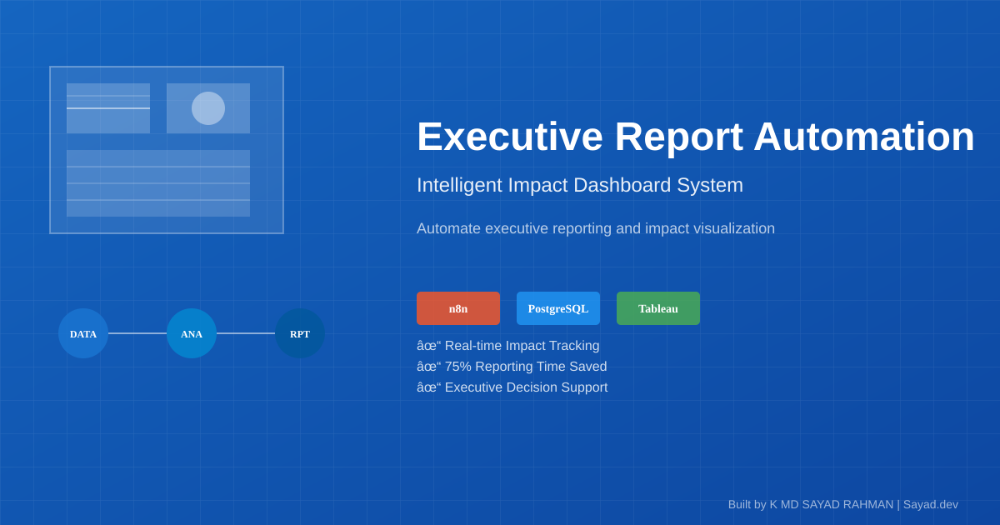
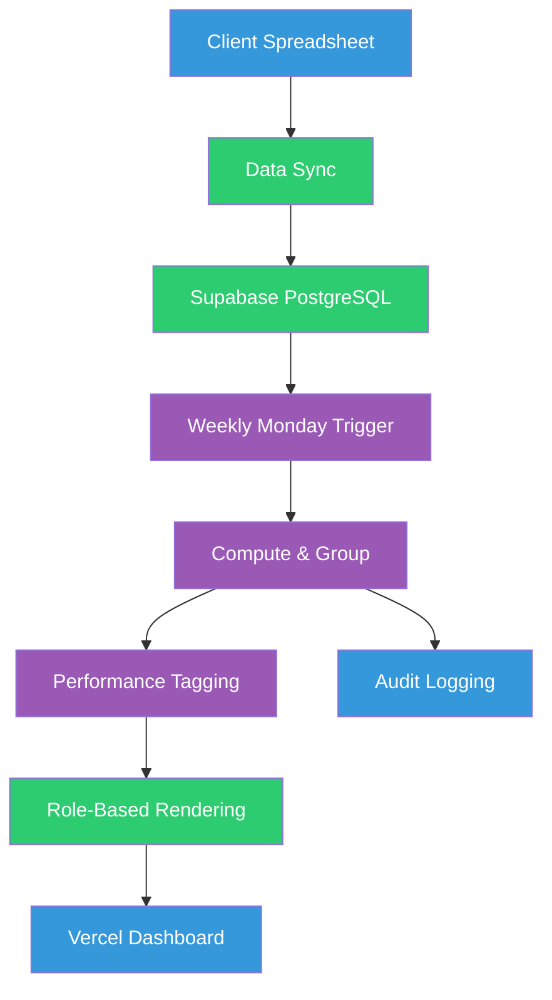

# Executive Teams: Automate Board Reporting Without Manual Prep

 
 


**Client:** Board of Directors | **Industry:** Executive Reporting | **Delivered by:** K MD SAYAD RAHMAN (Sayad.dev | AI Automation)

<!-- Professional Banner -->


<!-- Interactive Architecture Diagram -->
[View Interactive Architecture Diagram](https://raw.githubusercontent.com/mdsadrhoman123-stack/-impact-report-dashboard/main/assets/diagrams/executive-interactive.html)

---

## Automation Portfolio by K MD SAYAD RAHMAN

Explore my AI automation systems across different industries

### Real Estate AI Automation
[distressed-property-detection](https://github.com/mdsadrhoman123-stack/distressed-property-detection) - Property deal detection

### M&A Deal-Flow Automation
[edugrow-ma-platform](https://github.com/mdsadrhoman123-stack/edugrow-ma-platform) - M&A advisory systems

### Solar CRM Automation
[irish-solar-crm](https://github.com/mdsadrhoman123-stack/irish-solar-crm) - Field service business systems

### Healthcare Document Automation
[medical-document-automation](https://github.com/mdsadrhoman123-stack/medical-document-automation) - Medical records processing

### E-commerce Review Automation
[review-outreach-pipeline](https://github.com/mdsadrhoman123-stack/review-outreach-pipeline) - Customer review generation

### Enterprise Intake Automation
[flowdesk](https://github.com/mdsadrhoman123-stack/flowdesk) - Enterprise intake systems

### Payment Reconciliation Automation
[paybridge](https://github.com/mdsadrhoman123-stack/paybridge) - Finance automation

### Review Management Automation
[reviewshield-ai](https://github.com/mdsadrhoman123-stack/reviewshield-ai) - Reputation management

---
**Contact:** khandokarsayad@gmail.com | mdsadrhoman123@gmail.com  
**LinkedIn:** [linkedin.com/in/khandokarsabbir](https://linkedin.com/in/khandokarsabbir)

---

## Contents

- [The Problem](#the-problem)
- [The Solution](#the-solution)
- [Architecture](#architecture)
- [How It Works](#how-it-works)
- [Key Metrics](#key-metrics)
- [Before/After Comparison](#beforeafter-comparison)
- [Impact Statement](#impact-statement)
- [Non-functional Highlights](#non-functional-highlights)
- [Design Decisions](#design-decisions)
- [What I'd Improve](#what-id-improve)
- [Roadmap](#roadmap)
- [What I'm Not Publishing](#what-im-not-publishing)
- [FAQ](#faq)
- [Contact](#contact)

---

## The Problem

Boards and executives need a consistent weekly picture. Producing it by hand breaks down fast. A board secretary used to spend the better part of a day each week assembling department numbers into a report.

**In practical terms:**
- Manual assembly = **hours copying numbers every week**
- Error-prone & stale = **data old by meeting time**
- One-size-fits-none = **different roles need different detail levels**
- No reliable trail = **accountability challenges**
- Version confusion = **multiple spreadsheet versions**

**The cost:** Day of manual work weekly plus risk of errors and stale data in executive decision-making.

---

## The Solution

Automated executive reporting system that turns raw departmental data into a boardroom-ready, role-based dashboard - delivered automatically every Monday, with zero manual prep.

**Core capabilities:**
- **Scheduled Delivery:** Report ready every Monday 9 AM - no one has to remember to run it
- **Role-Based Views:** Board/CEO/Manager each see the right depth from one dataset
- **Performance Detection:** Departments auto-tagged High Performance vs Needs Attention
- **Decoupled Architecture:** Report structure fully separated from data source
- **Client-Friendly Input:** Non-technical clients update data through familiar spreadsheet
- **Responsive & Shareable:** Single link that reads cleanly on any device

---

## Architecture



**Data Flow:**
1. **Input:** Client updates familiar spreadsheet with latest metrics
2. **Sync:** Data automatically synced to Supabase PostgreSQL
3. **Trigger:** Weekly Monday 9 AM automation activates
4. **Compute:** Data grouped by department and scored against targets
5. **Tag:** Performance auto-detected (High vs Needs Attention)
6. **Render:** Role-aware HTML dashboard generated
7. **Publish:** Dashboard goes live at stable URL
8. **Audit:** Every run logged for full traceability

---

## How It Works

### Step-by-Step Process:

1. **Data Collection:** Latest metrics land in live datastore from client spreadsheet
2. **Scheduled Trigger:** Weekly automation wakes every Monday morning
3. **Data Processing:** Data grouped by department and scored against targets
4. **Performance Analysis:** Departments auto-tagged based on target achievement
5. **Role-Based Rendering:** Three views generated (Board/CEO/Manager) from single dataset
6. **Dashboard Generation:** Clean, responsive HTML dashboard created
7. **Automated Publishing:** Dashboard goes live at stable URL
8. **Audit Logging:** Every generation logged for accountability and traceability

### Technology Stack:
- **Orchestration:** n8n Workflow Automation
- **Database:** Supabase PostgreSQL for data storage
- **Hosting:** Vercel for live dashboard deployment
- **Trigger:** Scheduled automation (Monday 9 AM)
- **Input:** Client-friendly spreadsheet interface
- **Frontend:** Responsive HTML dashboard
- **System Type:** Automated Executive Reporting System

---

## Key Metrics

| Metric | Value |
| :--- | :--- |
| Schedule | Weekly Monday 9 AM |
| Role Views | 3 (Board/CEO/Manager) |
| Audit Coverage | 100% |
| Manual Prep Time | 0 minutes |

---

## Before/After Comparison

### BEFORE (Manual Reporting - Time-Consuming)
```
[Department Data] 
    ↓ (manual collection)
[Spreadsheet Assembly] 
    ↓ (hours of work)
[Manual Calculation] 
    ↓ (error-prone)
[Generic Report] 
    ↓ (one-size-fits-all)
[Email Distribution] 
    ↓
= **Day of manual work, stale data, no role customization** ❌
```

### AFTER (Automated Reporting - Instant)
```
[Client Spreadsheet Update] 
    ↓ (familiar interface)
[Automated Data Sync] 
    ↓ (instant)
[Monday Morning Trigger] 
    ↓ (scheduled)
[Auto Performance Tagging] 
    ↓ (intelligent)
[Role-Based Dashboard] 
    ↓ (3 views)
[Live URL Access] 
    ↓
= **Zero manual prep, fresh data, role-specific insights** ✅
```

**The difference:** Executive reporting that's ready before Monday meetings with zero manual preparation time.

---

## Impact Statement

**Business Value Delivered:**
- **Zero manual prep** eliminates day of weekly work
- **Fresh data every Monday** ensures decisions based on current information
- **Role-based views** provide right detail level for each stakeholder
- **Automated performance tagging** highlights areas needing attention
- **Single source of truth** eliminates version confusion

**Client ROI:** Executive decision-making supported by current, role-appropriate data with zero manual preparation overhead.

---

## Non-functional Highlights

**Reliability & Error Handling:**
- **Scheduled Reliability:** Monday 9 AM trigger ensures consistent delivery
- **No Silent Failures:** System either produces report or raises alert
- **Audit Trail:** 100% of runs logged for accountability
- **Decoupled Architecture:** Data source and presentation evolve independently
- **Production-Grade:** Built for executive-level reliability requirements

**Performance:**
- **Instant Dashboard Generation:** Automated processing in minutes
- **Real-Time Data Sync:** Spreadsheet to database synchronization
- **Responsive Design:** Works cleanly on any device
- **Scalable Architecture:** Handles increased departments and metrics

**Executive Experience:**
- **Role-Appropriate Detail:** Each stakeholder sees relevant information depth
- **Performance Detection:** Automatic highlighting of high/low performers
- **Single Link Access:** Easy sharing without version confusion
- **Professional Presentation:** Boardroom-ready formatting and layout

---

## Design Decisions

**Why This Architecture:**
- **Spreadsheet Input:** Non-technical clients comfortable with familiar interface
- **Role-Based Views:** Different stakeholders need different information depth
- **Decoupled Design:** Data structure changes don't break reporting
- **Monday Schedule:** Reports ready before week's executive meetings
- **Performance Tagging:** Automatic detection highlights focus areas

**Trade-offs:**
- **Schedule vs Real-Time:** Weekly schedule vs. real-time updates (balance freshness vs stability)
- **Complexity vs Capability:** Role-based views add complexity but provide better user experience
- **Spreadsheet vs Database:** Familiar input vs. technical interface (usability vs. control)

---

## What I'd Improve

With more time/budget:
- **Real-Time Updates:** On-demand dashboard refresh capability
- **Advanced Analytics:** Trend analysis and predictive insights
- **Custom Report Builder:** User-configurable report layouts
- **Multi-Format Export:** PDF, Excel, and other export options
- **Integration Expansion:** Direct ERP and business system connections

---

## Roadmap

- [ ] **v2.0:** Real-time on-demand dashboard updates
- [ ] **Advanced Analytics:** Trend analysis and predictive insights
- [ ] **Custom Builder:** User-configurable report layouts
- [ ] **Multi-Format:** PDF, Excel export options
- [ ] **ERP Integration:** Direct business system connections

---

## What I'm Not Publishing

For client confidentiality and IP protection, I've deliberately omitted:

- Workflow exports and internal automation logic
- Database schema, queries, and migration scripts
- Report-engine source and generation code
- Credentials, endpoints, environment configuration
- Real client data and identifying metrics
- Proprietary performance tagging algorithms

**This is a real client system for executive reporting. Board confidentiality applies.**

---

## FAQ

**Q: How does the role-based view work?**  
A: Single dataset generates three different views - Board (strategic), CEO (operational), Manager (tactical).

**Q: What if the client misses the spreadsheet update?**  
A: System uses last available data and sends notification that update is needed.

**Q: Can the schedule be customized?**  
A: Yes, scheduling is flexible and can be adjusted to meet specific executive meeting cycles.

**Q: Is the dashboard mobile-friendly?**  
A: Yes, responsive design ensures clean reading on any device.

---

## Contact

**K MD SAYAD RAHMAN** - Sayad.dev | AI Automation

**Work Email:** khandokarsayad@gmail.com  
**Personal Email:** mdsadrhoman123@gmail.com  
**LinkedIn:** https://linkedin.com/in/khandokarsabbir  
**GitHub:** https://github.com/mdsadrhoman123-stack

**Open to Work - Accepting New Automation Projects**

**Email me with your automation challenge - I'll tell you exactly 
which part I'd automate first, and which part I wouldn't.**

---

## See My Other Automation Systems

- [Real Estate AI Automation](../distressed-property-detection) - Property deal detection
- [M&A Deal-Flow Automation](../edugrow-ma-platform) - M&A advisory systems
- [Healthcare Document Automation](../medical-document-automation) - Medical records processing
- [Enterprise Intake Automation](../flowdesk) - Client request processing

---

<div align="center">

**Built by K MD SAYAD RAHMAN (Sayad.dev | AI Automation)**

**Contact:** khandokarsayad@gmail.com | mdsadrhoman123@gmail.com

Copyright (c) 2024 K MD SAYAD RAHMAN. All rights reserved. Portfolio use only.

*[n8n](https://n8n.io) | [Supabase](https://supabase.com) | [Executive Automation](https://linkedin.com/in/khandokarsabbir)*

</div>